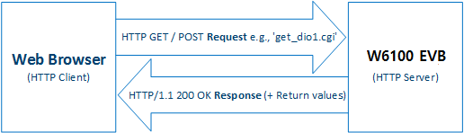
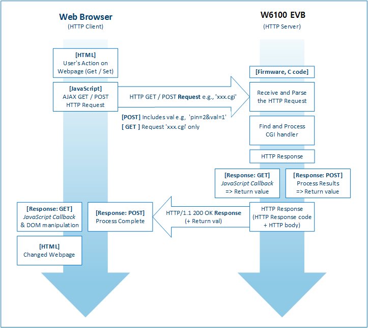

# HTTP Server Example for W6100-EVB
Common to Any MCU, Easy to Add-on. Internet Offload co-Processor, HW TCP/IP chip,
best fits for low-end Non-OS devices connecting to Ethernet for the Internet of Things. These will be updated continuously.

## How to Use
The HTTP server library is roughly composed of the following functions.
- httpServer_init(): Handler the HTTP server initialization (user's buffer, H/W sockets for HTTP)
- reg_httpServer_webContent(): Function for example web page registration
  - webpages, javascript function pages, images and etc.
- httpServer_run(): HTTP server process handler in main routine.

** web page examples are located in 'webpages.h' file.

W6100-EVB uses AJAX method and pre-defined CGI function to configure the network or monitor and control the I/O.

  

CGI for W6100-EVB consists the 'Request name + .cgi' using HTTP GET/POST request method. The CGI for each HTTP methods are handled as below.

  

### GET
- The method for getting the values from web server
- Passed in the form of a JavaScript callback function parameters
  - Same structures as JSON
  - The function name in the HTTP response body must be the same on the Web page's JavaScript Callback function name
  - e.g., If the 'function IoStatusCallback' is Javascript function name in the Web page, web server must pass the data as next; DioCallback({"dio_p" : "0"}, {"dio_s" : "0"}, {"dio_d" : "2"})

### POST
- The method for putting the changed values to web server
- Values are passing by the Web form element
- Key-value pairs; Each pair is separated by '&' and the Key/value of a pair is represented by '='
  - e.g., 'Pin : 1, Val : 1' ⇒ 'Pin=1&Val=1'

### Pre-defined GET/POST CGI Name Example
- GET (Get)
  - get_netinfo.cgi (Network information, Return MAC/IP/GW/SN/DNS/LLA/GUA/SN6/GW6/DHCPen/)

- POST (Set)
  - set_diostate.cgi (Setting the Digital I/O status, Post requset have to includes 'pin=x&val=y', 0(low) or 1(high))

 
## TEST Result 
### serial Display 
  
### Web Page Main 
  
### Web Page NetWork Info 
  
### Web Page RGB LED Control 
  
